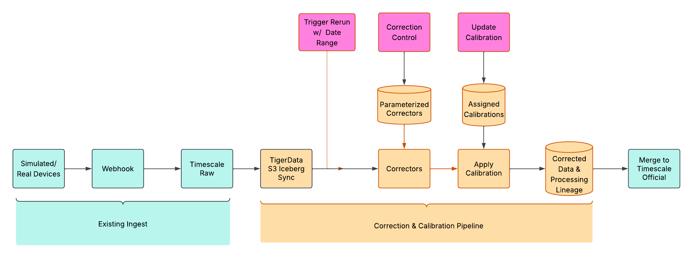

# Sensor Data Correction and Calibration Pipeline. 

## Overview
Hardware sensors measure fundamental physical parameters, such as voltage, current, and time.  These are then converted into a meaningful parameters for descision making and discovery: gas concentrations, energy transmission rates, flow volumes, etc.  To report accurae measurements, sophisticated mathematical equations typically run on the sensor hardware to do this conversion, in form of various signal processing corrections to the low level measurement, and calibration algorithms to convert this measurement into the parameter of interest.  This pipeline is rarely exposed to data consumers, the process for applying adjustments is typically obscure, and historical updates to corrective parameters is often not tracked.  This significantly reduces the reliability of the data, requiring extensive re-study and re-processing by scientific data users, or simply accepting unknown inaccuracies in data.

This project presents a proof of concept for moving low level data processing to the cloud.  Rather than tuning and applying measurement correction and calibration parameters on the sensor itself, by saving parameters in the device's memory, these values are stored and applied in the cloud.  The sensor device retains the responsibility for produce a reliable fundamental physical measurement, while the cloud converts this into the environmental parameter of interest.  This architecture has several advantages.  First, conversion algorithms can be developed, optimized, and re-run iteratively on data without require device firmware updates.  Second, correction and calibration control parameters can be updated and tracked in a device specific data processing lineage.  Third, device re-calibrations can be tracked historically, viewed, modified, and re-run as well.  And fourth, the correction and calibration pipelines themselves can be re-ordered and improved over tim, again without requiring time consuming field visits to deployed sensors.

## Technical Summary
This project is built to consume data from the existing RRIV open source environmental sensor device inventory and telemetry platform, which ingests data into TimescaleDB.  Data is synced through Iceberg tables to Snowflake for pipeline processing.  Processing runs through a DAG in Snowflake, with control parameters for each step stored in a lineage tracking table that is later exported back to TimescaleDB along with the corrected and calibrated data for service.  The pipeline runs automated every hour, or can be triggered for arbitrary date range rerun to process changes in control parameters.  Control parameters are updated through database tables.  Data outputs are synced back to TimscaleDB via S3 and patch overwrite data from previous in the official data service tables.

For this proof of concept, some simplifications were made. 
* APIs for control updates and pipeline outputs are not implemented.  
* Device specific calibration is not implemented, with all devices uses thes same calibration equation and parameters.
* Several correction steps were left unimplemented, with algorithm development left to data science.


## Goals
1. Build a raw data correction and calibration pipeline with control and lineage tracking.
2. Assess TimescaleDB to Iceberg integration and round trip architecture.


## Project Structure

```
.
├── db/                 TimescaleDB ingest & serving schema (SQLAlchemy + Alembic)
├── diagrams/           Diagrams describing and scoping the proof of concept
├── infra/              Terraform + AWS/Snowflake/Tiger Cloud resource provisioning
├── pipeline/           Snowflake SQL correction & calibration pipeline
├── snowsight/          Snowsight worksheets / dashboards
├── import/             Ad-hoc SQL snippets for generating test meter data
└── README.md           Project overview and operating instructions
```

### Detail: `pipeline/` — Snowflake correction & calibration pipeline

Numbered directories run in order; `*.test.sql` files sit beside the step they verify.

| Path | Purpose |
| --- | --- |
| `0-setup-integration/` | Iceberg and S3 return-path external integrations |
| `1-setup-pipelines/` | Stages, lineage table, lineage utilities, correction control |
| `2-correction-pipeline-steps/` | Per-step SQL: claim data → delete ranges → warmup, low-cutoff and drift corrections → quality flags → apply calibrations → export |
| `3-correction-calibration-pipeline-dag/` | Snowflake task DAG plus a manual re-run variant |

## Diagram


## Example Output

### Lineage record for a single automatic processing or manual re-processing run
```
+--------------------------------------+-------------------------+--------------------------------------------+-------------------------------------------+
| LINEAGE ID                           | CREATED_AT              | ATTRIBUTES                                 | DEVICES                                   |
|--------------------------------------+-------------------------+--------------------------------------------+-------------------------------------------|
| 72cbc6e9-4dda-42ea-bad2-3140c209b767 | 2026-08-24 09:10:02.847 | {                                          | [                                         |
|                                      |                         |   "apply_calibrations": {                  |   {                                       |
|                                      |                         |     "calibration": "applied"               |     "attributes": {                       |
|                                      |                         |   },                                       |       "low_cutoff": 8.999999999999999e-03 |
|                                      |                         |   "corrected_data_warmup": {               |     },                                    |
|                                      |                         |     "warmup_interval": 600                 |     "serial_number": "flow_002"           |
|                                      |                         |   },                                       |   },                                      |
|                                      |                         |   "corrected_low_cutoff": {                |   {                                       |
|                                      |                         |     "low_cutoff": "applied"                |     "attributes": {                       |
|                                      |                         |   },                                       |       "low_cutoff": 3.000000000000000e-03 |
|                                      |                         |   "processing_range": {                    |     },                                    |
|                                      |                         |     "prelude": "2026-08-24 14:30:00.000",  |     "serial_number": "flow_0001"          |
|                                      |                         |     "processed_at": "20260824_091007",     |   }                                       |
|                                      |                         |     "start_at": "2026-08-24 15:00:00.000", | ]                                         |
|                                      |                         |     "until": "2026-08-24 16:00:00.000"     |                                           |
|                                      |                         |   }                                        |                                           |
|                                      |                         | }                                          |                                           |
+--------------------------------------+-------------------------+--------------------------------------------+-------------------------------------------+
```

## How to Operate
The pipeline is operated and controlled via SnowSQL or SnowSight.  The snowsight/ directory contains example scripts for various operations.

### Update Correction Parameters
```
SELECT * FROM CORRECTION_CONTROL;
+---------------+------------------------+------------+
| SERIAL_NUMBER | WARMUP_PRELUDE_SECONDS | LOW_CUTOFF |
|---------------+------------------------+------------|
| DEFAULT       |                    600 |      0.009 |
| flow_0001     |                    600 |      0.003 |
+---------------+------------------------+------------+
```

```
UPDATE correction_control
SET low_cutoff = 0.003
WHERE serial_number = 'flow_0001';
```

### Update Calibrations
Calibrations are synced from TimescaleDB, where an API planned.  For test purposes, however, these can just be updated in Snowflake


```
select * from TIGERLAKE_TSDB_PUBLIC_CALIBRATION
+----+---------------+------------------+---------------------+-------------------------+-------------------------+
| ID | SERIAL_NUMBER | CALIBRATION_TYPE | PARAMETERS          | START_DATE              | END_DATE                |
|----+---------------+------------------+---------------------+-------------------------+-------------------------|
|  1 | flow_0001     | linear           | {"m":1.1, "b":0.12} | 2025-08-23 07:14:05.398 | 2026-08-23 07:14:05.398 |
|  2 | flow_0001     | linear           | {"m":0.9, "b":0.33} | 2026-08-23 07:14:27.857 | NULL                    |
+----+---------------+------------------+---------------------+-------------------------+-------------------------+
```

```
SET transition_ts = (SELECT CURRENT_TIMESTAMP());

-- Close out current calibration
UPDATE TIGERLAKE_TSDB_PUBLIC_CALIBRATION
SET end_date = $transition_ts
WHERE id = 2;

-- Insert the new calibration 
INSERT INTO TIGERLAKE_TSDB_PUBLIC_CALIBRATION (serial_number, calibration_type, parameters, start_date, end_date)
VALUES ('flow_0001', 'linear', OBJECT_CONSTRUCT('m', 0.8, 'b', 0.22), $transition_ts, NULL);
```

### Run pipeline
```
CALL test_run_correction_run('2026-08-18 00:00:00'::TIMESTAMP, DATEADD('day', 1, '2026-08-22 00:00:00'::TIMESTAMP));
```

### Investigate Lineage 
```
SELECT
    l.id,
    l.created_at,
    l.attributes,
    ARRAY_AGG(
        OBJECT_CONSTRUCT(
            'serial_number', dl.serial_number,
            'attributes', dl.attributes
        )
    ) AS devices
FROM lineage l
LEFT JOIN device_lineage dl
    ON dl.group_lineage = l.id
GROUP BY l.id, l.created_at, l.attributes;
```
